# 데이터 분석

### 사용한 데이터

데이터는 2019년 어떤 E-commerce 의 로그 데이터입니다.
시간은 GMT+4를 가정하고 분석을 진행했습니다.
분석에 사용된 데이터는 10월과 11월입니다.

### 10월과 11월만 사용한 이유

12월을 기점으로 전체 구매에서 스마트폰이 차지하는 비중이 급락하고 light가 급등합니다.

해당 원인을 파악하고자 데이터를 확인해본 결과 12월 이후의 데이터는 로그의 기록에 오류가 있음을 확인했습니다.

데이터를 신뢰할 수 없으므로 분석에서 사용하지 않습니다.

해당 근거는 data_problem.ipynb 에서 확인할 수 있습니다.

### 분석 진행 방향  

1. 시각화를 통한 EDA 

    시각화를 통해 어떠한 카테고리의 상품이 가장 판매나 조회가 많이 되는지 파악했습니다.

2. 시간당 접속 유저수의 변화  

    E-commerce 사이트에서 이벤트를 진행한다 가정, 해당 이벤트의 홍보효과를 최대화 하려 합니다.

    홍보효과를 최대화 하기위해 시간당 접속 유저 수가 가장 많은 시간 탐색합니다.

    2019년 10월의 데이터를 표본으로 생각하고 시간당 접속 유저수의 차이에 관해 통계적 가설검정을 실시했습니다.  

## 분석 세부 내용  

### 시각화를 통한 EDA
To_EDA.ipynb 에서 확인가능합니다.

분석을 위해 해당 파일 내에서 데이터 전처리를 진행하였습니다.

사용하는 데이터는 다음과 같습니다.
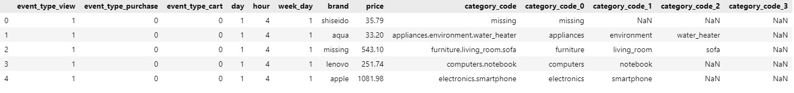

1. 요일별 User 행동유형 파악
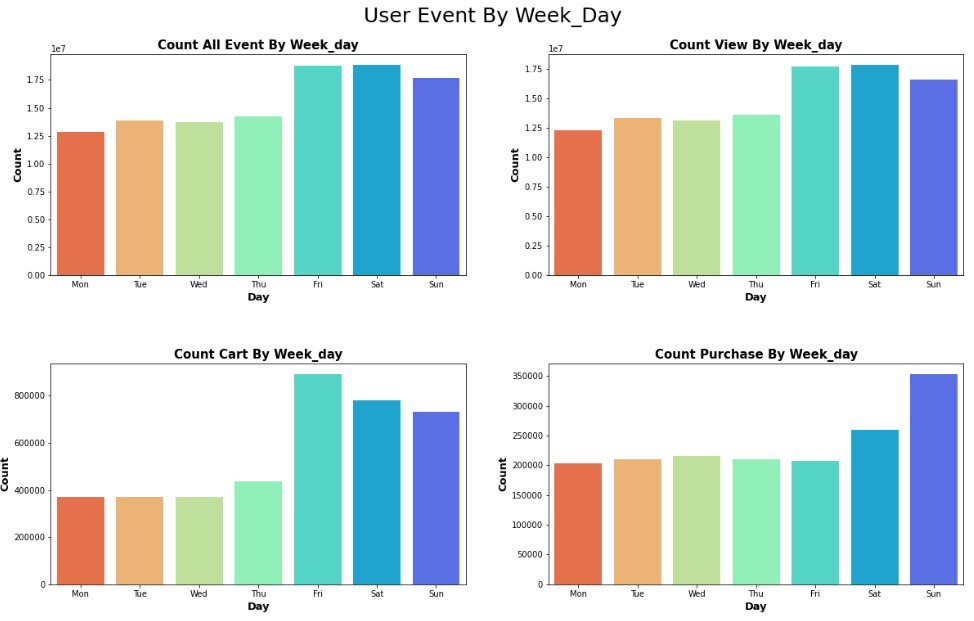
    좌측 상단 요일별 전체 행동유형   
    우측상단 요일별 제품 조회 횟수  
    좌측하단 요일별 제품 장바구니 보관 횟수  
    우측하단 요일별 구매 횟수  
    입니다.

    금요일 / 토요일 / 일요일에 조회, 장바구니담기가 많이 이뤄지나,  
    구매와는 다른 양상을 보입니다.

    또한,  
    y축을 보았을때 구매는 조회에 비해 2% 만 이뤄지는것을 알 수 있습니다.

2. 날짜별 User의 행동유형 파악
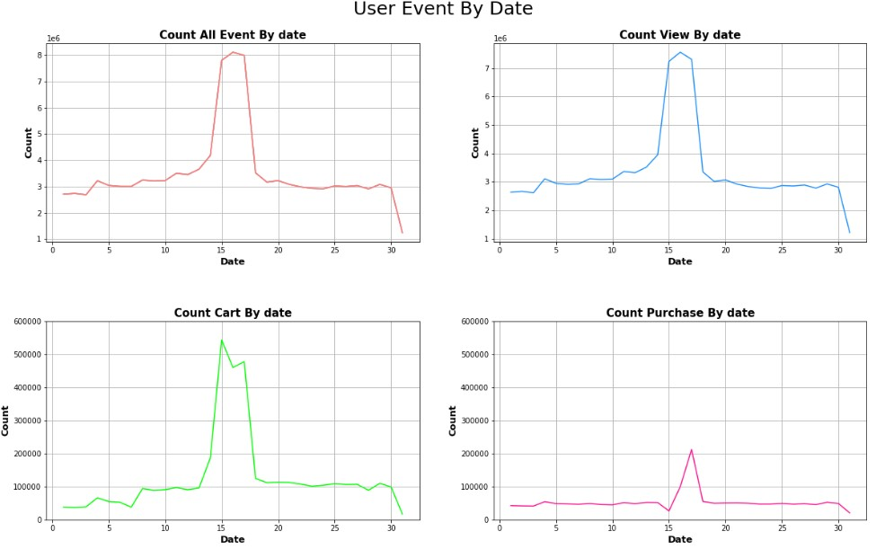
    좌측 상단 날짜별 전체 행동유형   
    우측상단 날짜별 제품 조회 횟수  
    좌측하단 날짜별 제품 장바구니 보관 횟수  
    우측하단 날짜별 구매 횟수  
    입니다.

    15일~17일에 조회,장바구니,결제가 확연히 많이 이뤄지나,  
    이상치값이 있는지 확인해 보아야 합니다.

3. 시간별 User의 행동유형 파악
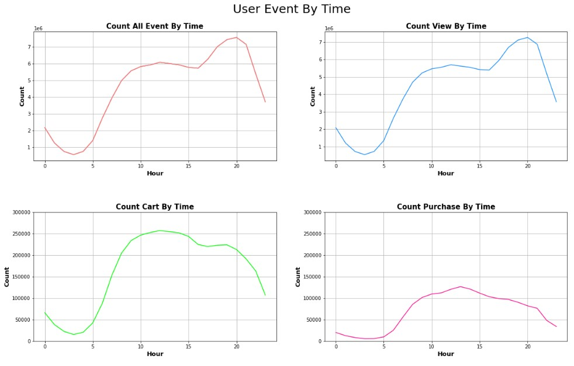
    좌측 상단 시간별 전체 행동유형   
    우측상단 시간별 제품 조회 횟수  
    좌측하단 시간별 제품 장바구니 보관 횟수  
    우측하단 시간별 구매 횟수  
    입니다.

    조회의 경우 5~10시, 16~20시까지 증가하는 추세이나,  
    장바구니담기의 경우 5~12시까지 증가,
    결제의 경우 5~12까지 증가하기에,
    16~20시의 조회는 결제로 이뤄지지않는 아이쇼핑으로 짐작됩니다. 

4. 1차 카테고리별 매출 비교
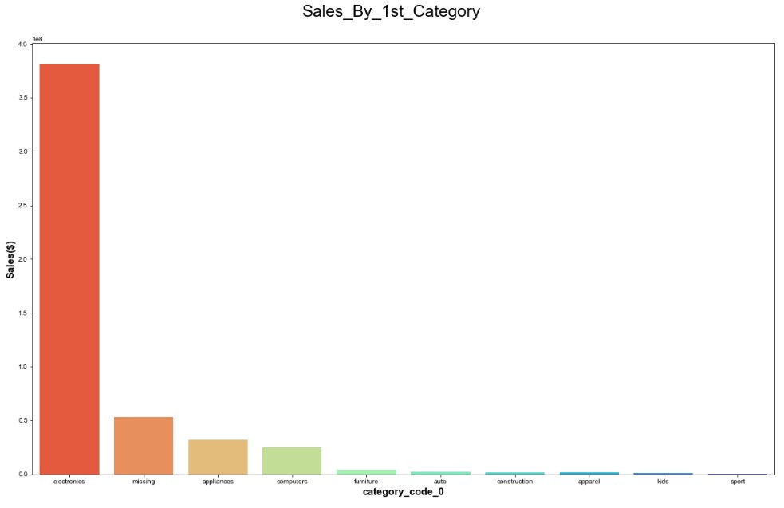
    결측치를 제외하곤,  
    electronics, missng, appliances, computers, furniture 순으로 매출을 보이며,
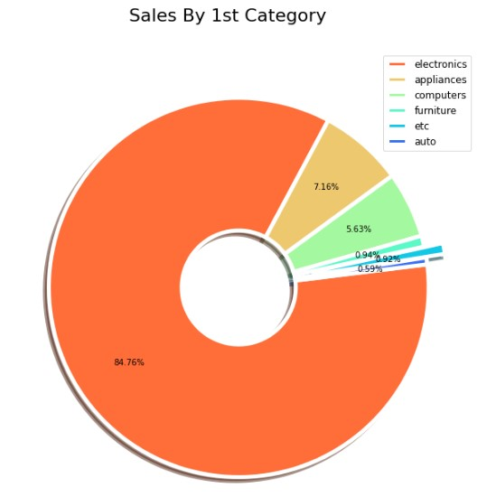  
    electronics 제품이 84.76% 매출의 큰 비중을 차지합니다.

5. 2차 카테고리별 매출 비교
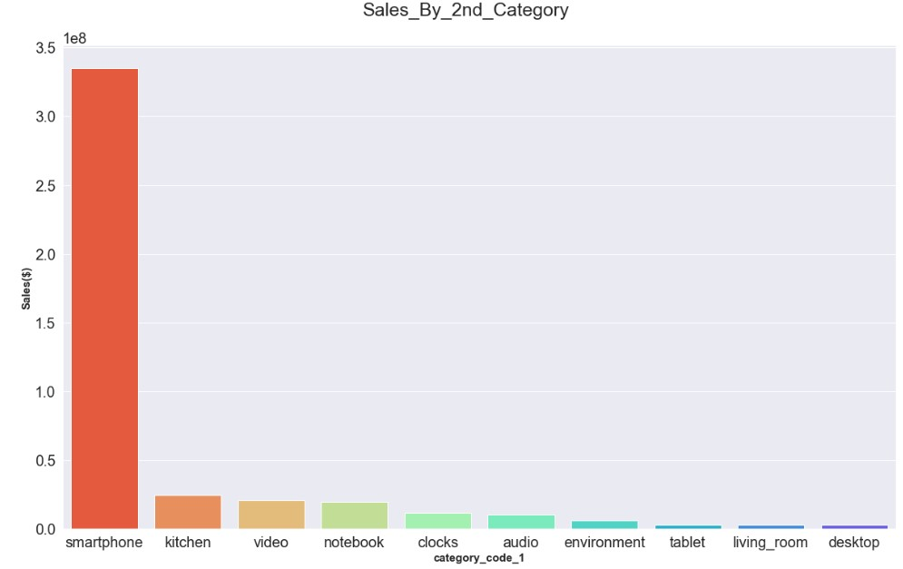  
    smartphone, kitchen, video, notebook, clocks
    순으로 매출을 보이며,  
    electronics제품군의 smartphone이 약 75%를 차지합니다.

6. 3차 카테고리별 매출 비교
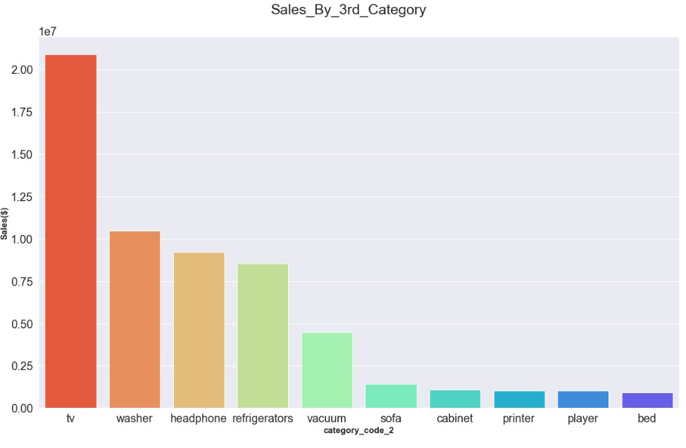
    electronics제품군의 video에 속하는 tv  
    appliances제품군의 kitchen에 속하는 washer  
    electronics제품군의 audio에 속하는 headphone  
    순으로 매출을 보이며,
    y축의 비율이 10^7로 한자릿수 감소하였기에,  
    3차 카테고리까지 설정된 제품군의 파이는 2차카테고리보다 크지 않다고 볼 수 있습니다.

7. 브랜드별 매출 비교
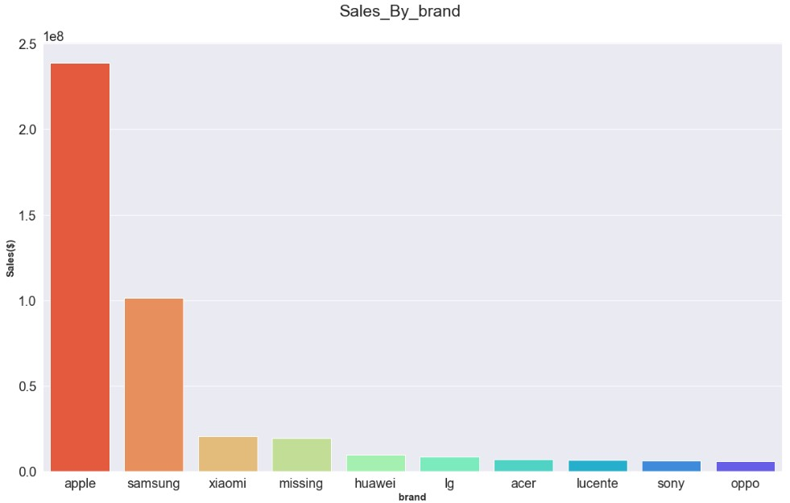  
    apple, samsung, xiaomi 순으로  
    매출과 동일하게 전자제품이 주 판매원인 브랜드가 강세였으며,  
    이중 보편적으로 휴대폰 양대산맥으로 불리우는 apple, samsung이  
    상위를 차지한것으로 보아 휴대폰판매비중이 높다는 것을 간접적으로  
    느낄 수 있습니다.

### 시간당 접속 유저수의 변화  
test_by_time.ipynb 에서 확인가능합니다.

분석을 위해 데이터를 가공했습니다.

데이터 가공과정은 make_time_data_frame.ipynb에서 확인가능합니다.

사용하는 데이터는 다음과 같습니다.

    

일별 시간당 매출액을 그래프로 나타내면 다음과 같습니다.

11월 16일을 기점으로 시간당 매출액이 급하게 증가해서 17일에 최고점에 도착합니다.

특수한 사건에 의해 매출의 증가가 이루어졌다고 판단했습니다. 

추후 분석에 악영향을 미칠 수 있으므로 해당 날자들을 데이터에서 제거했습니다.

제거 후 다시 그래프를 그리면 다음과 같습니다.

이제 시간당 접속 유저수가 월별로, 날자별로, 시간대별로, 시간별로, 요일별로 다른가 통계적 가설검정을 실시합니다.

1. 10월과 11월의 시간당 접속유저수의 평균은 다른가?

        

    귀무가설 : 10월과 11월의 시간당 접속 유저수의 평균은 같다.
    대립가설 : 10월과 11월의 시간당 접속 유저수의 평균은 다르다.

    유의확률이 0에 가까운 값이 나왔습니다. 귀무가설을 기각합니다.

    11월의 시간당 접속 유저수의 평균이 10월의 시간당 접속유저수의 평균과 다릅니다.

2. 날자에 따른 시간당 접속유저수의 평균에 추세가 나타나는가?

    날자에 따라 분산분석을 실시하면 독립변수의 범주가 너무 많이져서 해석에 있어 직관성을 잃을수 있습니다. 

    따라서 추세가 존재하는가 단순선형회귀를 통해 확인했습니다.

    귀무가설 : 회귀계수는 0이다. (날자에 따라 시간당 접속유저수는 선형적인 추세가 없다.)

    

    회귀선에는 선형적인 추세가 없어보입니다.

    statsmodels 모듈을 통해 해당 회귀선의 유의성 검정결과를 확인해보면 다음과 같습니다.

        

    회귀계수의 유의성검정의 유의확률이 0.991입니다.

    따라서 날자에 따른 시간당 접속유저수의 평균에는 선형적인 추세가 나타나지 않습니다.

3. 시간대에 따라 시간당 접속유저수의 평균은 다른가?  

    해당 분석에서 사용한 시간대는 분석에 가정에서 사용되는 GMT+4를 기준으로 해당 지역을 두바이로 가정하고 임의로 시간대를 지정했습니다.  
    변환한 시간대는 다음과 같습니다.  

        04시부터 12시 : morning
        12시부터 19시 : afternoon
        12시부터 22시 : evening
        22시부터 04시 : bedtime
    

    귀무가설 : 시간대에 따른 시간당 접속유저수의 평균은 모두 같다.  
    대립가설 : 시간대에 따른 시간당 접속유저수의 평균은 모두 같지는 않다.  

    유의확률이 0입니다. 따라서 귀무가설을 기각합니다.  
    시간대에 따른 시간당 접속유저수의 평균은 모두 같지는 않습니다.  
    어떤 시간대가 다른지 확인하기위해 Tukey HSD를 통해 다중비교를 실시했습니다.  
    
    

    다중비교 결과 afternoon과 evening의 시간당 접속유저수의 평균은 다르지 않고, 나머지는 모두 다르다고 나왔습니다. 

    afternoon과 evening은 시간당 접속유저수의 평균이 다르지 않다고 나왔기에 해당 시간별로 추가로 분산분석을 실시해보겠습니다.

4. afternoon과 evening의 시간에 따라 시간당 접속유저수의 평균은 다른가?

    

    귀무가설 : afternoon과 evening의 시간에 따라 시간당 접속유저수의 평균은 모두 같다.  
    대립가설 : afternoon과 evening의 시간에 따라 시간당 접속유저수의 평균은 모두 같지는 않다.

    유의확률이 0입니다. 따라서 귀무가설을 기각합니다.    
    afternoon과 evening의 시간에 따라 시간당 접속유저수의 평균은 모두 같지는 않다.  
    어떤 시간대가 다른지 확인하기 위해 Tukey HSD를 통해 다중비교를 실시한 결과 17시부터 20시까지는 동일하고 가장 높게 나타났습니다.  

 5. 요일별로 시간당 접속유저수의 평균은 다른가?

    

    귀무가설 : 요일별로 시간당 접속유저수의 평균은 모두 같다.  
    대립가설 : 요일별로 시간당 접속유저수의 평균은 모두 같지는 않다.

    유의확률이 0.829 입니다. 귀무가설을 기각하지 못합니다.
    요일별로 시간당 접속유저수의 평균은 모두 같습니다.    

### Marketing ActionPlan
To_ActionPlan.ipynb 에서 확인가능합니다.

#### 1. 상시 마케팅

    

    Top5를 제외한 카테고리를 etc로 처리 후 확인 결과  
    전체 매출의 약 85%가 electronics 제품군에서 발현됩니다.

    1.1 :   
    매출의 큰 비중을 차지하는 electronics 제품군에서 마케팅을 하는것이 효율적입니다.

    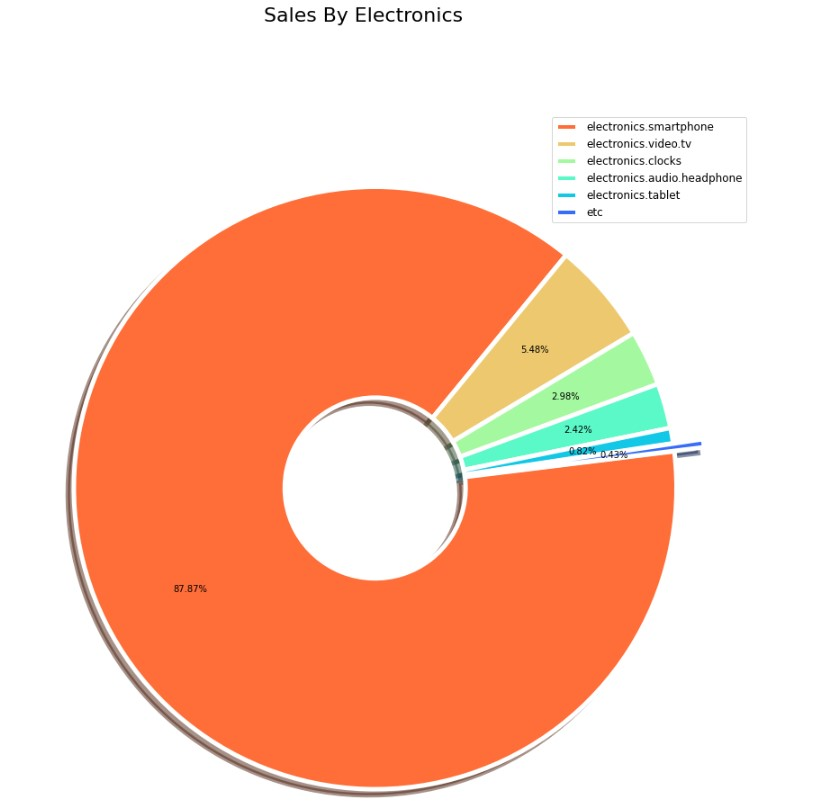  
    electronics 제품군 내 매출비중을 보았을때  
    smartphone, tv, clocks, headphone, tablet, etc 순으로 나타납니다.

      
    조회(view)대비 결제(purchase)를 확인 하였을때,  
    매출에 비해 tv, clocks의 전환율(CVR)이 낮습니다.

    1.2:  
    매출 비중이 큰 electronics내에서  
    매출비중은 top5내 이지만, 전환율이 양의 선형관계가 아닌  
    tv와 clocks 품목의 판매 독려를 위해 상시 세일 마케팅을 적용하여  
    매출 증대효과를 기대합니다.

#### 2. 타임세일형 마케팅
   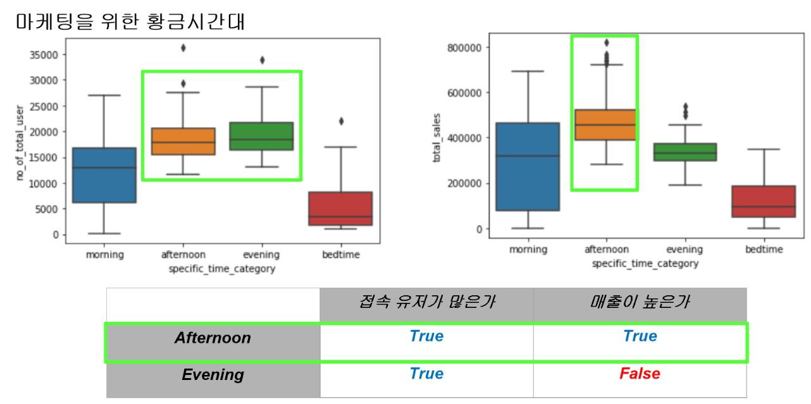
   시간당 접속 유저수의 변화를 통계적으로 다룬  
   test_by_time.ipynb 결과  
   2.1 :  
   접속유저가 유의하게 많고 매출도 유의하게 많은 Afternoon에 대해 마케팅을 집중한다.  

   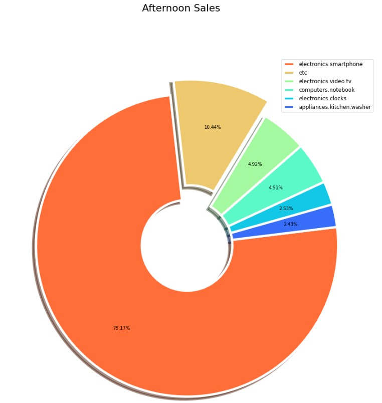  
   Top5를 제외한 카테고리를 etc로 처리 후 Afternoon의 판매 비중을 확인한 결과    
   smartphone, etc, tv, notebook, clocks, washer 순으로 나타납니다.

   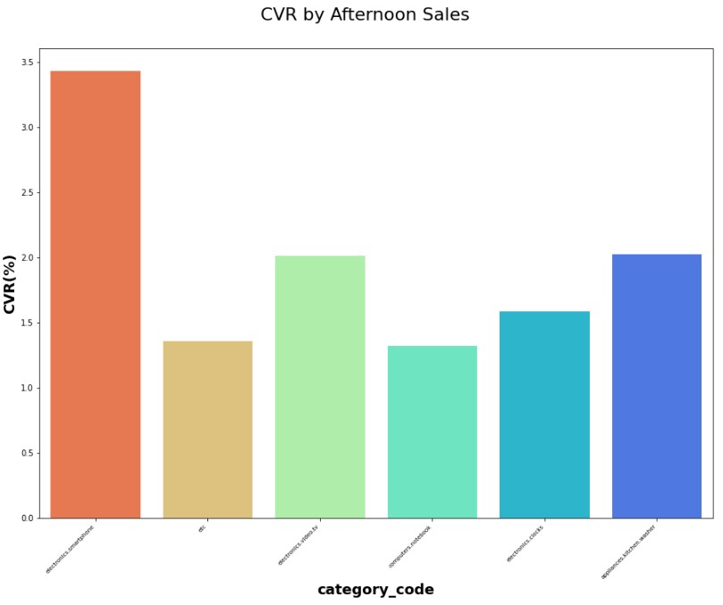  
   조회(view)대비 결제(purchase)를 확인 하였을때,
   매출에 비해 notebook의 전환율(CVR)이 낮습니다.

   2.2 :  
   접속유저와 매출이 유의미하게 많아 마케팅의 효율이 좋은 Afternoon에  
   판매비중은 top5안에 속하나, 전환율이 양의 선형관계가 아닌  
   notebook 품목의 판매 독려를 위해 Afternoon에 국한한 타임세일 마케팅을 적용하여  
   매출 증대 효과를 기대합니다.