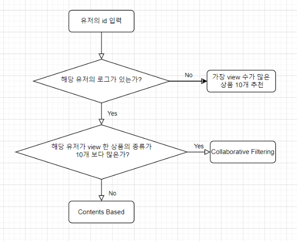

# 추천 모델링

### 유저가 view를 실시한 상품이 10개 이하면 CB 11개 이상이면 CF

### Contents Based model
해당 유저가 가장 관심있어하는 상품과 비슷한 상품을 추천하는 모델입니다.  

상품별로 해당 상품의 특성을 담은 데이터프레임을 생성하고 피어슨 유사도를 통해 가장 유사한 상품을 추천합니다.  

현재 데이터에 존재하는 상품이 너무 많아서 피어슨 유사도 계산에 문제가 있으므로 각 대주제 카테고리별로  

상품 데이터프레임을 생성하고 각 대주제 카테고리별로 피어슨 유사도 계산을 진행했습니다.  

즉 순서는 다음과 같습니다.

1. 해당 유저의 id 입력 
2. 해당 유저가 가장 많이 조회한 상품 id 확보 
3. 해당 상품의 대주제 카테고리 확인 
4. 해당 대주제 카테고리의 상품으로 이루어진 데이터프레임에서 유사도를 계산
5. 가장 유사한 제품 10개 추천 

CB 모델에서는 대주제 카테고리 또는 브랜드가 missing인 경우, 결과 해석의 문제와 데이터프레임이 너무 커지는 문제로 인해  
로그에서 삭제후 진행했습니다.

### Collaborative Filtering model
사용하는 데이터는 각 유저마다 각 상품에 대한 조회수로 유저의 선호도를 명확히 나타내주는 데이터가 아닌 Implicit 데이터입니다.

따라서 이런 데이터에 강건하다고 알려진 행렬분해 기법을 이용했습니다.

논문 Collaborative filtering for implicit feedback datasets 에서 나오는 ALS를 이용했습니다.

ALS의 계산은 implicit 모듈을 이용했습니다.

해당 모델에서 신뢰도(논문에서 나오는 alpha)는 40, 잠재벡터의 차원수는 20, 과적합 방지를 위한 람다는 20을 이용했습니다.